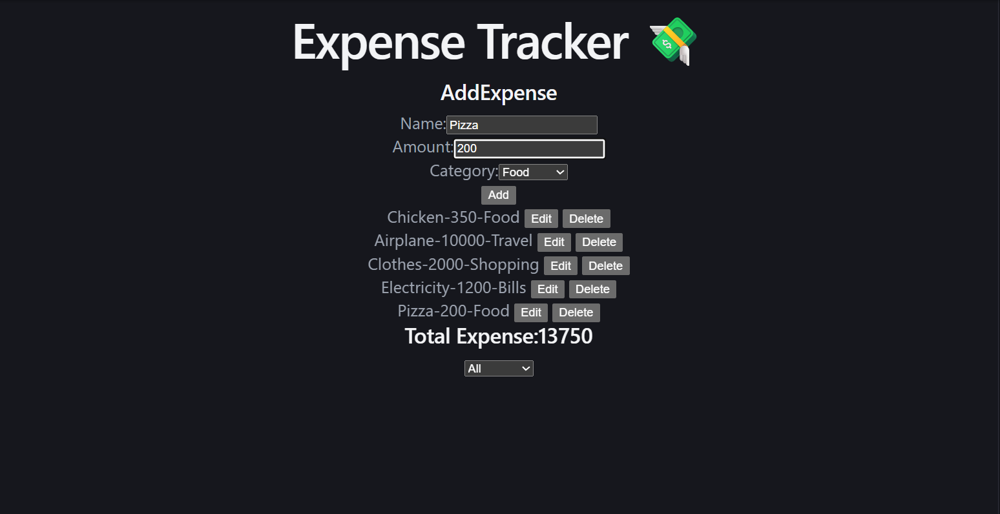

# React Expense Tracker

## Project Description

A React-based Expense Tracker application that allows users to add, edit, delete, and manage their daily expenses. The application also calculates the total expense and provides category-based filtering.

## Features

* Add new expenses
* Edit existing expenses
* Delete expenses
* Select expense categories
* Calculate total expenses
* Filter expenses by category
* Dynamic expense list rendering
* Reusable React components

## Tech Stack

* React.js
* JavaScript (ES6)
* HTML5
* CSS3
* Vite

## React Concepts Used

* React Components
* useState Hook
* Props
* Event Handling
* Conditional Rendering
* List Rendering
* Form Handling
* Array Methods (`map`, `filter`, `reduce`)

## Project Structure

```text
src/
├── components/
│   ├── AddExpense.jsx
│   ├── ExpenseItem.jsx
│   ├── ExpenseList.jsx
│   └── Summary.jsx
├── App.jsx
├── App.css
├── index.css
└── main.jsx
```

## How to Run

Clone the repository and install the dependencies:

```bash
npm install
```

Start the development server:

```bash
npm run dev
```

Open the local URL provided by Vite in your browser.

## Project Screenshot



## Author

Rohan Soni
